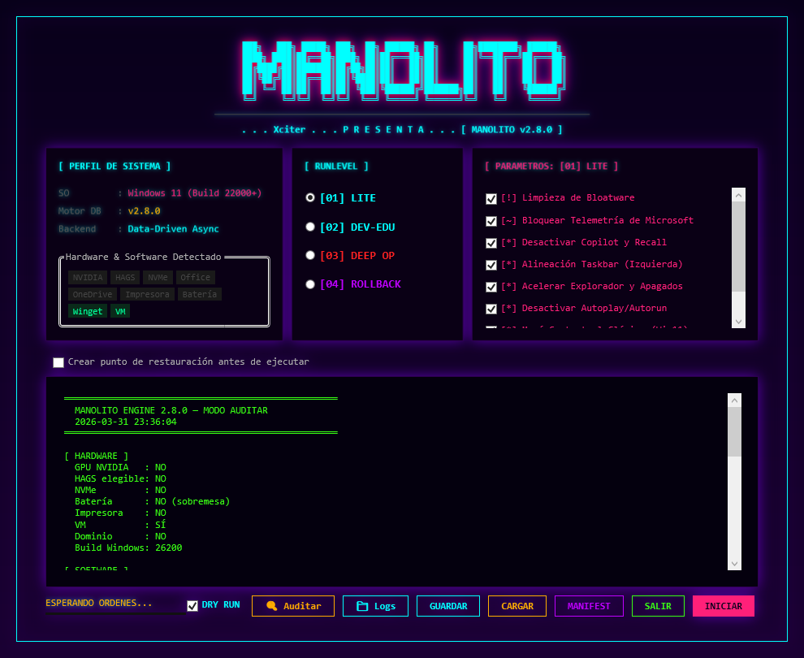

#

```text
 ███╗   ███╗ █████╗ ██████╗  ██████╗ ██╗     ██╗████████╗ ██████╗ 
 ████╗ ████║██╔══██╗██╔══██╗██╔═══██╗██║     ██║╚══██╔══╝██╔═══██╗
 ██╔████╔██║███████║██║  ██║██║   ██║██║     ██║   ██║   ██║   ██║
 ██║╚██╔╝██║██╔══██║██║  ██║██║   ██║██║     ██║   ██║   ██║   ██║
 ██║ ╚═╝ ██║██║  ██║██║  ██║╚██████╔╝███████╗██║   ██║   ╚██████╔╝
 ╚═╝     ╚═╝╚═╝  ╚═╝╚═╝  ╚═╝ ╚═════╝ ╚══════╝╚═╝   ╚═╝    ╚═════╝ 
──────────────────────────────────────────────────────────────────────
     . . . Xciter . . . P R E S E N T S . . .  [ MANOLITO v2.7.0 ]

Target OS  : Windows 11 Pro, Enterprise & Education (22000 - 26100+)
Framework  : PowerShell 5.1 (WPF Asynchronous + Runspaces)
Payload    : The Data-Driven Armor Update
Protection : MS Telemetry, Cloud Identity, KMS Hijackers, Bloatware
──────────────────────────────────────────────────────────────────────
```

//--[ I N F O ]------------------------------------------------------\

La telemetría no se tolera. El bloatware no se consiente.

Manolito ha evolucionado. Dejamos atrás los scripts de limpieza
imperativos básicos para entregar un Framework de Aprovisionamiento
Declarativo diseñado bajo principios de Confianza Cero. Retomamos el
control absoluto de Windows 11, extirpando la telemetría comercial,
purgando el ecosistema publicitario y aislando el sistema de backdoors
tóxicos.

Sin dependencias externas. Sin binarios opacos ni cajas negras.
Ingeniería de sistemas pura basada en PowerShell 5.1, multihilo nativo
mediante Runspaces, y una base de datos de cargas útiles (Payloads) en
formato JSON. Y por supuesto, sin pagar un duro...

//--[ C O R E   A R C H I T E C T U R E ]----------------------------\

    [!] Base de Datos Declarativa (manolito.json): Toda la lógica de
	negocio, riesgos y estados de reversión viven en un JSON estricto.
	El motor .ps1 orquesta, el JSON dicta. Añade tus propios tweaks
	sin tocar código.

    [!] Zero-Lag WPF UI: Interfaz gráfica Cyberpunk (CRT) construida
	sobre un modelo asíncrono. Las tareas pesadas de disco corren en
	un Runspace secundario usando colas concurrentes. Cero bloqueos.

    [!] Auditoría WMI en Tiempo Real: El motor escanea tu hardware en
	milisegundos (NVMe, GPUs NVIDIA, Batería, Dominio) y filtra
	activamente los payloads incompatibles para evitar roturas del
	kernel.

    [!] Manifest Time-Machine: Auditoría de estado in-session. El
	motor captura la memoria de tus Servicios, Tareas, Registro y DNS
	antes de alterarlos, permitiendo un Rollback milimétrico cargando
	el Manifest de la sesión.

//--[ P A Y L O A D S ]----------------------------------------------\

    Módulo DeKMS Hunter: Rastrea y destruye activadores KMS irregulares
	(KMSpico, HEU) consultando la clase SoftwareLicensingService,
	limpiando el registro SoftwareProtectionPlatform y eludiendo las
	detecciones.

    Appx Purge: Erradicación del ecosistema comercial (TikTok, Spotify)
	incluyendo paquetes provisionados, evitando que reaparezcan tras
	crear un nuevo usuario.

    Active Setup Killer: Fulmina entradas legacy de Active Setup que
	re-ejecutan procesos ocultos en cada inicio de sesión.

    Network & Hardware Tuning: Desactiva Nagle (TCPNoDelay) en
	interfaces de red físicas activas e inyecta Message Signaled
	Interrupts (MSI) directamente a los buses PCI de tus NVMe y GPUs.

//--[ U S A G E   &   D O C U M E N T A T I O N ]--------------------\

El motor requiere la presencia de manolito.ps1 y manolito.json en el
mismo directorio. Se requieren privilegios de Administrador.

Para evadir las políticas de restricción de ejecución en tu entorno:
powershell.exe -ExecutionPolicy Bypass -File .\manolito.ps1

📖  Consulta el [Manual Técnico de Operación y Arquitectura](docs/manual.md).
Detalles sobre cómo añadir tus propios Payloads al JSON, explicación de
los Runlevels y guía de Restauración mediante Manifests.

//--[ S U P P O R T   &   D O N A T I O N S ]------------------------\\

Manolito es un proyecto desarrollado de forma independiente con cientos 
de horas de ingeniería inversa, pruebas en laboratorio y depuración.

Si este motor te ha ayudado a rascar esos FPS extra en tu setup, ha 
salvado tu viejo portátil o te ha ahorrado horas de configuración tras 
un formateo, considera invitar al autor a un café (o a una bebida 
energética para las noches en vela):

[☕] Ko-fi   : https://ko-fi.com/mhg778
[💸] PayPal  : https://paypal.me/mhg778

Cualquier aporte ayuda a mantener el proyecto vivo, pagar los servidores 
de pruebas y seguir investigando las entrañas de Windows. ¡Gracias!
──────────────────────────────────────────────────────────────────────

//--[ L E G A L   &   L I C E N S E   ( D U A L ) ]------------------\\

Manolito es software libre de código abierto. Se distribuye bajo los 
términos de la licencia [GNU GPLv3](LICENSE).

Esto significa que eres completamente libre de usarlo, estudiarlo, 
compartirlo y modificarlo para uso personal, doméstico o en instituciones 
educativas públicas.

[!!!] AVISO PARA EMPRESAS Y PROVEEDORES IT (MSP) [!!!]
La licencia GPLv3 es estricta (Copyleft). El uso de este software en 
entornos corporativos, empresariales, o por parte de técnicos informáticos 
para dar soporte lucrativo a terceros, OBLIGA LEGALMENTE a liberar el 
código fuente de cualquier ecosistema derivado en el que se integre.

Si deseas utilizar Manolito de forma comercial en tu empresa SIN estar 
sujeto a las obligaciones de la GPLv3 sobre tu propia propiedad intelectual, 
debes adquirir una Licencia Comercial. Contacta con el autor.
